<div align="center">

<a href="https://github.com/ishandutta2007/Awesome-Awesome-Awesome"></a><a href="https://discord.gg/jc4xtF58Ve"></a> <a href="https://github.com/ishandutta2007/Awesome-Occupancy-Intelligence-Platform/stargazers"></a> <a href="https://github.com/ishandutta2007/Awesome-Occupancy-Intelligence-Platform/network/members"></a> <a href="https://github.com/ishandutta2007/Awesome-Occupancy-Intelligence-Platform/blob/main/LICENSE"></a> <a href="https://github.com/ishandutta2007/Awesome-Occupancy-Intelligence-Platform/pulls"></a> <a href="https://github.com/ishandutta2007"></a>

<br/><br/>



# 🏢 Awesome Occupancy Intelligence Platform 📡

**A curated index of top SaaS platforms and open-source GitHub projects for Occupancy Intelligence, Spatial Sensing, Smart Workplace Analytics & Real Estate Portfolio Optimization.**

[](https://github.com/ishandutta2007/Awesome-Awesome-Awesome)
[](https://github.com/ishandutta2007/Awesome-Occupancy-Intelligence-Platform)
[](https://github.com/ishandutta2007/Awesome-Occupancy-Intelligence-Platform/graphs/commit-activity)
[](https://github.com/ishandutta2007/Awesome-Occupancy-Intelligence-Platform/blob/main/README.md#-%EF%B8%8F-how-to-contribute)

</div>

---

## 📌 Table of Contents
- [🔍 Overview & Core Concepts](#-overview--core-concepts)
- [🏢 SaaS & Commercial Hosted Platforms](#-saas--commercial-hosted-platforms)
- [⚡ Open-Source GitHub Projects](#-open-source-github-projects)
- [🛠️ Architecture & Custom Implementation Patterns](#%EF%B8%8F-architecture--custom-implementation-patterns)
- [🏷️ Keywords & Search Index](#%EF%B8%8F-keywords--search-index)
- [🤝 How to Contribute](#-how-to-contribute)
- [📈 Star History](#-star-history)
- [⚖️ Disclaimer & Privacy Considerations](#%EF%B8%8F-disclaimer--privacy-considerations)

---

## 🔍 Overview & Core Concepts

**Occupancy Intelligence** bridges physical space and digital operations. Modern workplace analytics systems leverage **radar (mmWave)**, **thermal heat-mapping**, **computer vision edge AI**, **Wi-Fi CSI (Channel State Information)**, and **Bluetooth Low Energy (BLE)** to anonymously quantify space utilization.

### 🎯 Primary Use Cases:
- 📊 **Workplace & Real Estate Optimization**: Right-sizing hybrid office footprints, desk-to-employee ratios, and lease renewals.
- 💡 **Smart Building Energy Efficiency (HVAC & Lighting)**: Demand-controlled ventilation (DCV) and occupancy-driven BMS automations.
- 🧹 **Dynamic Facilities Management**: Scheduling custodial services and sanitation based on actual footfall rather than static timetables.
- 🔒 **Privacy-First Presence Sensing**: Anonymized headcounts and zone dwell times without capturing PII or intrusive video.

---

## 🏢 SaaS & Commercial Hosted Platforms

> 📊 **Market Overview & Scale**: The global Occupancy Sensing & Workplace Analytics market is valued at **~$3.0B–$3.4B (2025/2026)** and projected to expand to **~$6.7B–$9.7B by 2033–2035** (growing at an ~11%–13.5% CAGR). The sector is **highly fragmented** rather than concentrated/winner-take-all, characterized by a diverse blend of industrial building-automation conglomerates, specialized optical/thermal sensor startups, and software-only Wi-Fi analytics integrators tackling siloed space-utilization data.

The table below ranks enterprise SaaS occupancy intelligence platforms by **Company Scale / Valuation (descending)**:

| Platform | Company Scale / Valuation | Description | Pricing | Free Tier / Free Trial Limits |
| :--- | :--- | :--- | :--- | :--- |
| **[Openpath / Avigilon Alta](https://www.openpath.com/)** | **~$300M+ Enterprise Value** *(Acquired by Motorola Solutions; Parent NYSE: MSI Market Cap: **~$75B+**)* | Cloud access control and presence/occupancy sensing ecosystem with mobile credentials and reader hardware. | Software starting from **$5.00/reader/month** (Basic tier, ~$60/door/year) + hardware starting **~$300/reader** | **30-day integrator pilot evaluation** limited to 1–2 test doors/entryways; no free forever plan |
| **[Density](https://www.density.io/)** | **$1.05B Valuation** *(Unicorn status, Series D; $225M total funding; ~$45.2M est. annual revenue)* | Radar-based people-counting and occupancy analytics platform with doorway and area sensors plus unified Atlas analytics. | Hardware from **$229/sensor** (or $149 starting); Software from **$2.50/desk/mo** or **$8.00/room/mo** (billed annually; $15/unit monthly) | **30-day pilot program** limited to 1–2 test floors / designated zones; no free forever plan |
| **[Butlr](https://www.butlr.com/)** | **~$150M–$300M Est. Valuation** *(Series B, $78.5M total funding; enterprise AI partner)* | Thermal (heat-based) occupancy sensing platform that is privacy-first (no cameras, no PII), wireless, and API-oriented. | Hardware from **$149/sensor** (Heatic 2+); Software/API subscription starting at **$2.50/desk/mo** to **$8.00/room/mo** (~$280/yr starter renewal) | **30-day Starter Kit evaluation trial** limited to 5–10 Heatic sensors and cloud dashboard/API access; no free forever plan |
| **[VergeSense](https://www.vergesense.com/)** | **~$150M–$250M Est. Valuation** *(Series C, $82.6M total funding; ~$22M est. annual revenue)* | Occupancy intelligence platform combining computer-vision sensors with analytics, benchmarking, and AI space-planning. | Hardware starting from **~$149/sensor**; Software subscription starting from **~$0.03–$0.06/sq. ft./month** | **30–60 day proof-of-concept pilot** scoped to high-value test areas/rooms with free site survey; no free forever plan |
| **[Infogrid](https://www.infogrid.io/)** | **$120M+ Total Funding** *(~$39.4M est. annual revenue; enterprise scale)* | Smart-building platform combining IoT occupancy, environmental, and cleaning efficiency sensors with AI analytics. | Starting from **~$0.03–$0.05/sq. ft./month** (or **~$100–$250/building/month** base tier for sensor suite) | **30-day guided pilot deployment** limited to select facility zones / 1 test floor; no free forever plan |
| **[XY Sense](https://xysense.com/)** | **~$40M–$60M Est. Valuation** *(Series A, $20.8M total funding; ~$8.4M est. annual revenue)* | Workplace occupancy and utilization platform using ceiling sensors to deliver space-level insights for real estate teams. | Software & sensor access starting at **~$0.05/sq. ft./month** (based on standard 16,000 sq. ft. office deployment) | **30-day structured pilot trial** limited to 1 floor / test area with live demo setup; no free forever plan |
| **[Occuspace](https://www.occuspace.io/)** | **~$25M–$40M Est. Valuation** *(Seed/Series A, $6M+ total funding; ~$6.8M est. annual revenue)* | Plug-and-play occupancy and space-utilization platform using wide-area Bluetooth/Wi-Fi signal monitors (Macro sensors). | Starts at **$600/year** for spaces under 5,000 sq. ft. (~$0.12–$0.20/sq. ft./year; 1 sensor covers 2,500–5,000 sq. ft.) | **30-day turnkey pilot kit program** limited to 1–2 Macro sensors covering test zone with ROI audit; no free forever plan |
| **[PointGrab](https://www.pointgrab.com/)** | **~$20M–$35M Est. Valuation** *(Series B, $18.7M total funding)* | AI-powered optical sensing and CogniPoint edge-computing sensors for desk and room occupancy tracking in commercial buildings. | Software license starting from **~$15.37/device/month** ($768.75/50 devices via marketplace) + hardware | **30–60 day CogniPoint 2 Flex pilot trial** limited to 1 pilot room / test installation; no free forever plan |
| **[Locatee](https://www.locatee.com/)** | **~$15M–$30M Est. Valuation** *(Series A, $15.3M total funding; ~$3.3M est. annual revenue)* | Workplace analytics platform focused on occupancy and utilization insights across office portfolios using network data. | Software starting from **~$0.02–$0.05/sq. ft./year** (or **~$1.50–$3.00/employee/year** based on Wi-Fi/LAN data ingest) | **30-day proof-of-concept pilot** limited to 1 building/floor baseline analysis; no free forever plan |
| **[Disruptive Technologies](https://www.disruptive-technologies.com/)** | **~$15M–$25M Est. Valuation** *(~$6M+ total funding; ~$11.2M est. annual revenue)* | Miniature wireless sensor ecosystem (peel-and-stick desk & motion sensors) with DT Studio cloud integration. | **$999 one-time** for Sensor Starter Kit (includes Cloud Connector gateway + 10 sensor credits) + DT Studio at **~$2–$5/sensor/month** | **30-day DT Studio cloud trial** included with Starter Kit bundle (limited to 10 kit sensors & 1 gateway); no free forever plan |

---

## ⚡ Open-Source GitHub Projects

Open-source repositories providing presence detection, people counting, Wi-Fi CSI sensing, radar integrations, and IoT spatial telemetry. Sorted by **GitHub Star Count (descending)**:

1. 📡 **[RuView](https://github.com/ruvnet/RuView)** [](https://github.com/ruvnet/RuView/stargazers)  
   Turns commodity Wi-Fi (CSI) signals into real-time spatial intelligence, room presence, and vital-sign monitoring without cameras or optical capture.

2. 🏡 **[Home Assistant Core](https://github.com/home-assistant/core)** [](https://github.com/home-assistant/core/stargazers)  
   Open-source home and smart building automation engine featuring integrations for mmWave radar sensors, PIR, BLE beacons, and multi-zone room presence tracking.

3. 🎥 **[Frigate NVR](https://github.com/blakeblackshear/frigate)** [](https://github.com/blakeblackshear/frigate/stargazers)  
   High-performance NVR with real-time local AI object detection (Coral/OpenVINO), person detection, zone occupancy counting, and MQTT telemetry.

4. 📊 **[ThingsBoard](https://github.com/thingsboard/thingsboard)** [](https://github.com/thingsboard/thingsboard/stargazers)  
   Scalable open-source IoT platform for device telemetry, occupancy data ingestion pipelines, rule-chain alerts, and real-time visualization dashboards.

5. ⚡ **[ESPHome](https://github.com/esphome/esphome)** [](https://github.com/esphome/esphome/stargazers)  
   Firmware ecosystem for ESP32/ESP8266 devices powering mmWave radar presence detectors (Hi-Link LD2410/LD2450), PIR motion, and thermal grid sensors.

6. 📹 **[ZoneMinder](https://github.com/ZoneMinder/zoneminder)** [](https://github.com/ZoneMinder/zoneminder/stargazers)  
   Full-featured video surveillance and computer-vision motion/presence detection engine for multi-camera facility monitoring and recording.

7. 🚀 **[Scrypted](https://github.com/koush/scrypted)** [](https://github.com/koush/scrypted/stargazers)  
   High-performance video integration and edge AI automation platform featuring real-time person detection, presence sensing, and smart space automation.

8. 📍 **[FIND3](https://github.com/schollz/find3)** [](https://github.com/schollz/find3/stargazers)  
   Framework for Internal Navigation and Discovery using Wi-Fi and BLE signal fingerprinting for precision room-level positioning and tracking.

9. 📶 **[BLE Monitor](https://github.com/custom-components/ble_monitor)** [](https://github.com/custom-components/ble_monitor/stargazers)  
   Passive Bluetooth Low Energy sensor monitor tracking BLE beacons, wearable tags, smart badges, and environmental sensors.

10. 🏙️ **[OpenRemote](https://github.com/openremote/openremote)** [](https://github.com/openremote/openremote/stargazers)  
    100% open-source IoT & smart building management platform designed for asset tracking, facility automation, and multi-sensor space occupancy monitoring.

11. 🛋️ **[Room Assistant](https://github.com/mKeRix/room-assistant)** [](https://github.com/mKeRix/room-assistant/stargazers)  
    Presence tracking and room-level occupancy detection engine powered by Raspberry Pis, Bluetooth LE beacons, thermal sensors, and ultrasonic distance modules.

12. 👁️ **[Kerberos Agent](https://github.com/kerberos-io/agent)** [](https://github.com/kerberos-io/agent/stargazers)  
    Lightweight, scalable edge computer-vision agent capable of streaming, motion tracking, and physical occupancy detection for smart spaces.

13. 🔢 **[Intel OpenVINO People Counter](https://github.com/intel-iot-devkit/people-counter-python)** [](https://github.com/intel-iot-devkit/people-counter-python/stargazers)  
    Edge AI video analytics application using OpenVINO for real-time person detection, doorway counting, and space occupancy duration analysis.

14. 🌡️ **[R-U-Still-There](https://github.com/paxswill/r-u-still-there)** [](https://github.com/paxswill/r-u-still-there/stargazers)  
    Open-source thermal-imaging presence sensor for home and office automation, detecting both stationary (sitting/sleeping) and moving occupants via MQTT.

---

## 🛠️ Architecture & Custom Implementation Patterns

For custom deployments, teams typically combine open sensing protocols with modern time-series telemetry pipelines:

```
[ Sensing Layer ]                [ Transport / Broker ]        [ Analytics & Action ]
┌─────────────────────────┐      ┌────────────────────┐      ┌────────────────────────┐
│ • mmWave Radar (LD2410) │      │                    │      │ • InfluxDB / Timescale │
│ • Thermal (AMG8833/MLX) ├─────►│ MQTT Broker        ├─────►│ • Grafana Dashboards   │
│ • Wi-Fi CSI (RuView)    │      │ (EMQX / Mosquitto) │      │ • Home Assistant Core  │
│ • Edge CV (Frigate/YOLO)│      │                    │      │ • Building HVAC / DCV  │
└─────────────────────────┘      └────────────────────┘      └────────────────────────┘
```

- **Anonymous Sensing First**: Deploy mmWave radar and thermal arrays over optical cameras in sensitive private office spaces.
- **Edge Analytics**: Process computer vision streams locally at the edge (on-device OpenVINO or Coral TPU) to ensure raw video frames are discarded immediately.
- **Telemetry Standardization**: Standardize occupancy state metrics into open time-series schemas (`zone_id`, `headcount`, `dwell_duration_seconds`, `utilization_rate`).

---

## 🏷️ Keywords & Search Index

`occupancy-intelligence` • `workplace-analytics` • `smart-buildings` • `space-utilization` • `people-counting` • `presence-detection` • `mmwave-radar` • `wifi-csi` • `thermal-imaging` • `iot-telemetry` • `proptech` • `desk-occupancy` • `facilities-management` • `building-automation`

---

## 🤝 How to Contribute

Contributions, suggestions, and corrections are warmly welcomed!

1. 🍴 Fork the repository.
2. 🌿 Create a new feature branch (`git checkout -b feature/add-platform`).
3. 📝 Add your entry (ensure all SaaS submissions include pricing tiers and free trial/tier limits, or open-source repo with star badge).
4. 🚀 Submit a Pull Request with a brief summary of the addition.

---

## 📈 Star History

[](https://star-history.dera.page/#ishandutta2007/Awesome-Occupancy-Intelligence-Platform&type=date&legend=top-left)

---

## ⚖️ Disclaimer & Privacy Considerations

- This is a **community-curated index** for informational and research purposes; it does not constitute an endorsement.
- Occupancy sensing in workplace settings must comply with local labor regulations, employee privacy standards (e.g., GDPR, CCPA), and works council agreements.
- Anonymous sensing modalities (thermal, radar, aggregated Wi-Fi signals) are strongly recommended over identifiable video capture.

---

<div align="center">

Made with ❤️ for workplace, real-estate, and facilities innovation teams.

</div>
